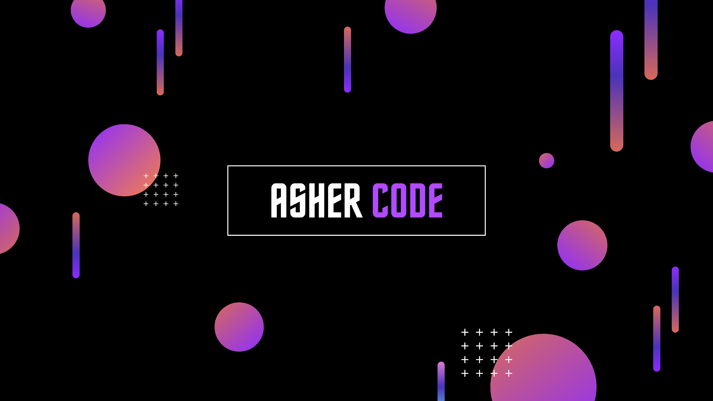

# Hi there, I'm [AsherCode][website] 

I'm a creative coder and self-taught React developer who is passionate about coding and learning new things every day. My current aims are to have a community to participate with, get a job, and code large projects to share, thus I'm now sharing my journey and constructing in public on twitter and [hashnode].

### Connect with me:

[][website]
[][twitter]
[][linkedin]
[][instagram]
[][Behance]

 
 

### Languages and Tools:

## :zap: GitHub Stats

  

  

[website]: https://jolly-hugle-b11123.netlify.app/
[instagram]: https://www.instagram.com/ashercode19/
[linkedin]: https://www.linkedin.com/in/alonso-sandoval-889590187/
[behance]: https://www.behance.net/alonsosandoval2/
[Twitter]: https://www.twitter.com/CodeAsher
[hashnode]: https://ashercode.hashnode.dev/
<!-- BLOG-POST-LIST:START -->

<!-- BLOG-POST-LIST:END --> 
